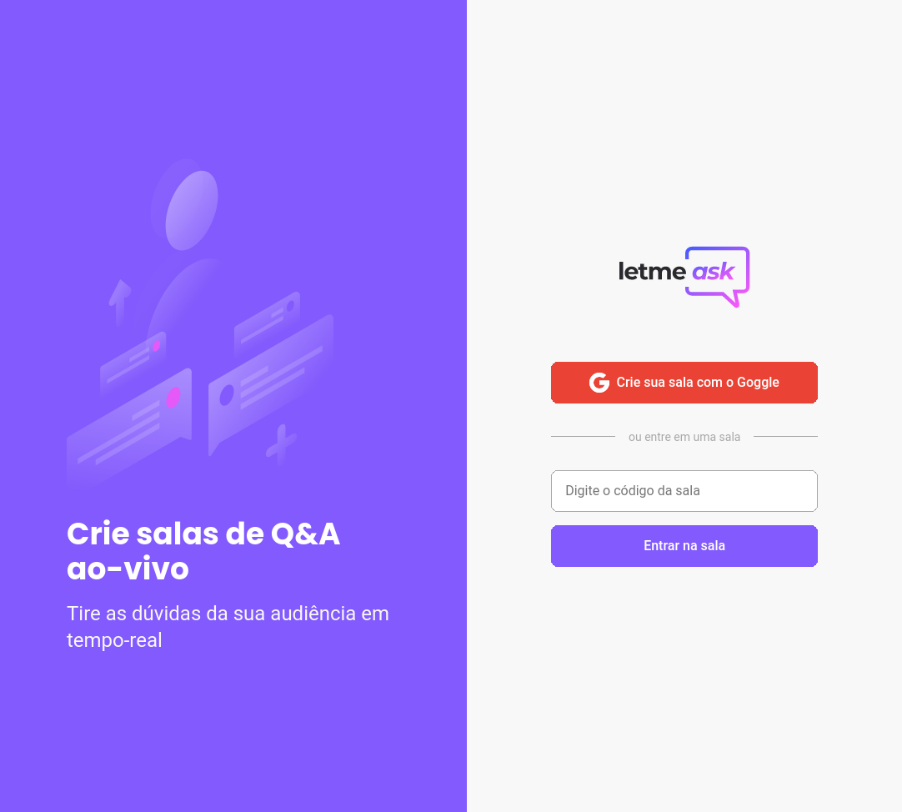
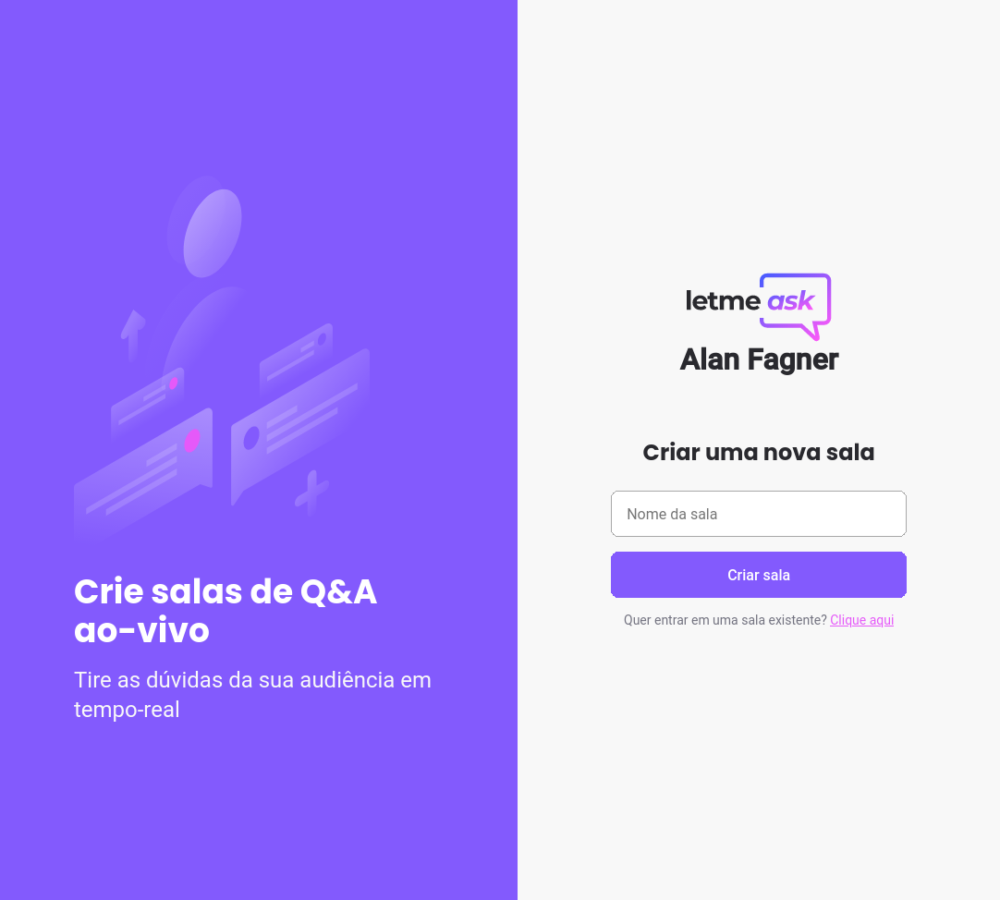
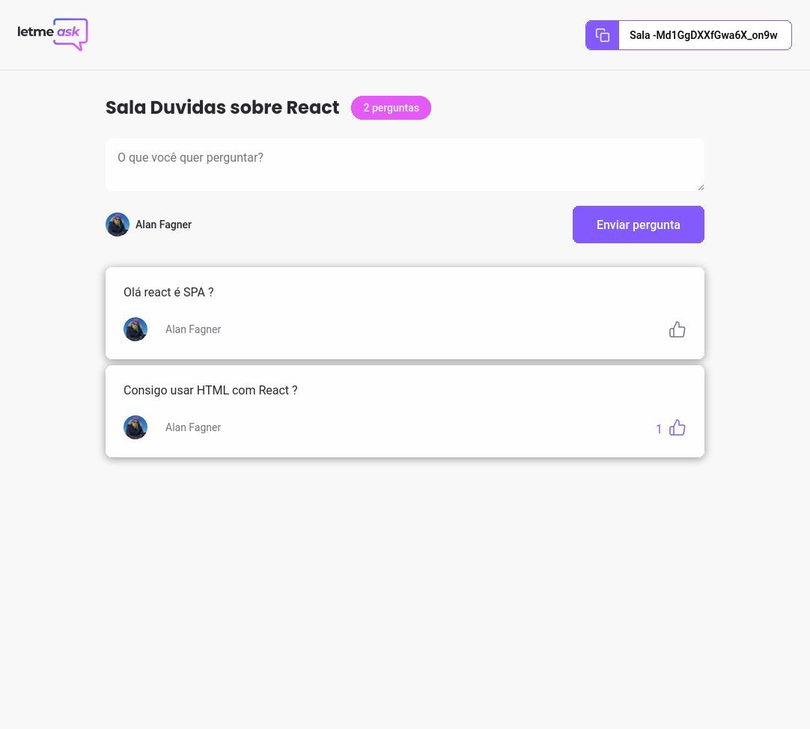
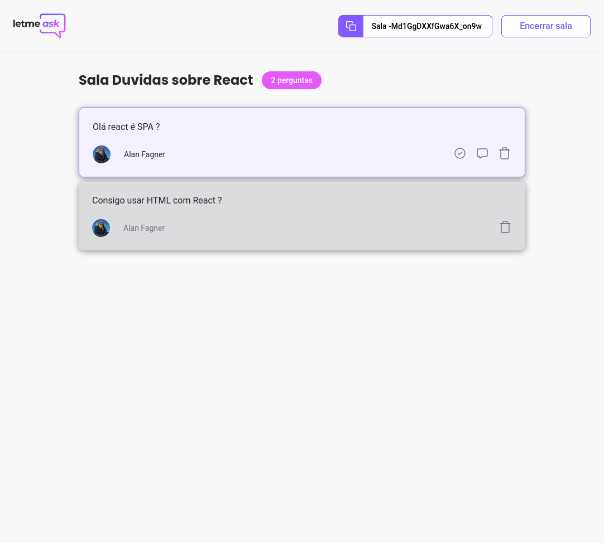

<h1 align="center">
  
</h1>

 <a href="#-Sobre">Sobre</a>&nbsp;&nbsp;&nbsp;|&nbsp;&nbsp;&nbsp; 
 <a href="#-Conteúdo">Conteúdo</a>&nbsp;&nbsp;&nbsp;|&nbsp;&nbsp;&nbsp;
 <a href="#-Tecnologias">Tecnologias</a>&nbsp;&nbsp;&nbsp;|&nbsp;&nbsp;&nbsp;
 <a href="#-Images">Images</a>

<h3 align="center">
  :rocket: [NLW#] LetMeAsk
</h3>

## 💻 Sobre

Projeto desenvolvido durante o NLW da Rocketseat, ReactJs, firebase.

## 🚀 Conteúdo
### Algumas __funcionalidades__
* Criar login, utilizando o google.
* CRUD(create, read, update, delete) de perguntas.
* Responder perguntas.
* Marcar como respondido as perguntas.
* Curtir perguntas.
* Atividades em tempo real.

## 🚀 Tecnologias
### Algumas tecnologias utilizadas:
- **[ReactJS](https://developer.mozilla.org/en-US/docs/Glossary/HTML)**
- **[Firebase](https://firebase.google.com)**
- **[Google Auth2](https://developers.google.com/identity/protocols/oauth2)** 

## 🚀 Images
### Screenshots

  
   
  
  

